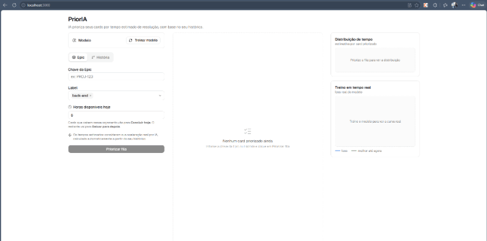
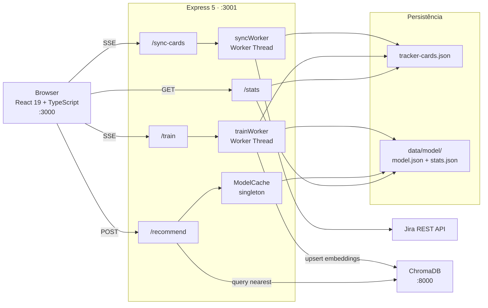

# PriorIA

> Projeto desenvolvido durante a pós-graduação em **Engenharia de Software com IA Aplicada**, no módulo de Fundamentos de IA e LLMs — com o professor **Erick Wendel**.

A proposta do módulo era replicar um sistema de recomendação com banco vetorial, simulação de produção e rede neural treinada com TensorFlow.js. Decidi aplicar o conceito diretamente no meu dia a dia como desenvolvedor: **priorizar automaticamente a fila de cards do issue tracker com base no meu próprio histórico de resolução.**


---



---

## Por que é diferente

A maioria dos ferramentais de planning usa story points ou estimativas manuais. Este projeto aprende **do seu histórico individual** e, mais importante, **mede o impacto que ferramentas de IA tiveram no seu ritmo de trabalho**.

O `accelerationRate` é calculado comparando pares de cards semanticamente similares resolvidos **antes e depois** de uma data de corte que você define (`AI_START_DATE`). Usando similaridade vetorial (dot-product nos embeddings do USE), o sistema encontra tarefas equivalentes nos dois períodos e mede a razão de tempo de resolução. Se você está resolvendo tarefas similares 40% mais rápido após adotar IA, esse fator é aplicado automaticamente às estimativas futuras.

```
Dado histórico (card resolvido pré-IA)   → embedding → vetor pré
Dado histórico (card resolvido pós-IA)   → embedding → vetor pós
                                                   ↓
                          similaridade(vetor pré, vetor pós) ≥ 0.65?
                                                   ↓ sim
                          ratio = horasPos / horasPré  →  accelerationRate
```

O resultado aparece no **AI Impact Dashboard**: um número em destaque mostrando `−X% mais rápido pós-IA` com gráfico de linha temporal marcando o ponto de virada.

---

## Como funciona

O sistema conecta na API do issue tracker, coleta os cards que já resolvi e quanto tempo cada um levou. Com esses dados, passa por três fases:

### Fase 1 — Embeddings (representação semântica)

O título e a descrição de cada card são concatenados e transformados num vetor de **512 números** pelo **Universal Sentence Encoder (USE)**. Cards semanticamente parecidos ficam próximos no espaço vetorial, o que permite que a rede neural generalize por significado — não por palavras-chave.

```text
"Fix login bug on mobile" → [0.12, -0.45, 0.03, ... 512 valores]
```

Esses vetores são armazenados no **ChromaDB** para reutilização — se o mesmo card aparecer novamente, o embedding não é recalculado.

### Fase 2 — Treinamento da rede neural

Com os embeddings dos cards já resolvidos, treina uma rede neural de regressão em um **Worker Thread** dedicado (não bloqueia o servidor durante o treino):

- **Entrada (X):** vetor de 512 dimensões do embedding do card
- **Saída (y):** `hoursToResolve` normalizado entre 0 e 1

A arquitetura se adapta ao volume de dados — veja a seção [Rede neural](#arquitetura) para detalhes.

O modelo aprende a associar "esse tipo de texto" com "esse número de horas", com base no histórico de quem treinou. Os pesos são persistidos em `data/model/model.json` junto com o min/max das horas para desnormalização.

> Cards sem worklog registrado recebem automaticamente o mínimo de **40 minutos** (`hoursToResolve`) para não serem descartados do treinamento.

### Fase 3 — Predição e priorização

Para cada card **em aberto**, o sistema:

1. Gera o embedding do texto
2. Consulta os 100 cards mais similares no ChromaDB (busca vetorial)
3. Passa o embedding pelo modelo treinado → desnormaliza para horas reais
4. Aplica o `accelerationRate` (fator de aceleração pós-IA medido no treino)
5. Ordena todos os cards do menor para o maior tempo estimado
6. Marca quais cabem no dia (`fitsToday`) com base nas horas disponíveis informadas

---

## Arquitetura



**Rede neural** — regressão para prever horas de resolução. A arquitetura se adapta ao tamanho do dataset:

| Cards | Arquitetura | Regularização |
| ----- | ----------- | ------------- |
| < 300 | Dense(512→64) → Dense(64→32) → Dense(1) | — |
| 300–1000 | Dense(512→128) → Dropout(0.2) → Dense(128→64) → Dense(1) | Dropout 20% |
| > 1000 | Dense(512→256) → Dropout(0.2) → Dense(256→128) → Dense(128→64) → Dense(1) | Dropout 20% |

O treinamento usa **early stopping** com patience adaptativo — treinos menores param em até 200 épocas, maiores em até 500. Sem overfitting forçado.

---

## Stack

| Camada | Tecnologia |
| ------ | ---------- |
| Frontend | React 19 + TypeScript + Tailwind CSS 4 |
| Backend | Express 5 + Node.js 20 |
| ML | TensorFlow.js 4 + Universal Sentence Encoder |
| Banco vetorial | ChromaDB 3 (Docker) |
| Embeddings | `@tensorflow-models/universal-sentence-encoder` (512 dims) |
| Logging | Pino (JSON em produção, pretty em dev) |
| Validação | Zod |
| Issue tracker | **Jira** (única integração suportada atualmente) |

---

## Rodando o projeto

### Opção 1 — Docker Compose (recomendado)

```bash
git clone <url> && cd prioria
cp .env.example .env
# Edite .env com suas credenciais ou defina DEMO_MODE=true

docker compose up
```

Acesse `http://localhost:3001`.

### Opção 2 — Desenvolvimento local

**Pré-requisitos:** Node.js 20+, Docker

```bash
# 1. Suba o ChromaDB (versão 0.5.x — necessário para compatibilidade com o client npm)
docker run -p 8000:8000 chromadb/chroma:0.5.23

# 2. Instale e configure
npm install
cp .env.example .env

# 3. Rode
npm run dev   # frontend :3000 + backend :3001
```

### Modo demonstração (sem Jira)

```bash
# No .env:
DEMO_MODE=true
VITE_DEMO_MODE=true

npm run dev
```

Acesse `http://localhost:3000` → **Treinar modelo** → **Priorizar fila**.

### Modo produção (com Jira)

> O projeto usa a **Jira REST API v3** e JQL. O sync filtra cards pelo campo customizado `"Ajustado por[Short text]"` — verifique se esse campo existe no seu projeto ou ajuste a JQL em `server/services/TrackerService.js`.

```bash
# No .env:
TRACKER_EMAIL=seu@email.com
TRACKER_API_TOKEN=seu_token          # https://id.atlassian.com/manage-profile/security/api-tokens
TRACKER_BASE_URL=https://sua-empresa.atlassian.net
TRACKER_ACCOUNT_ID=seu_account_id   # visível em: BASE_URL/rest/api/3/myself
TRACKER_PROJECT_KEY=PROJ
DEMO_MODE=false
VITE_DEMO_MODE=false
```

No app: **Sincronizar** → **Treinar** → **Priorizar fila**.

---

## Deploy público (Railway)

1. Fork este repositório
2. Crie um projeto na [Railway](https://railway.app) e adicione um serviço ChromaDB (plugin)
3. Defina as variáveis de ambiente (ou `DEMO_MODE=true` para demo público)
4. Railway detecta o `Dockerfile` automaticamente via `railway.json`
5. Deploy em ~2 minutos

---

## Fluxo de dados detalhado

### O que são embeddings

Embedding é a transformação de texto em um vetor de números que representa o **significado semântico** da frase — não as palavras literais. Textos com sentido parecido ficam próximos no espaço vetorial mesmo usando vocabulários diferentes:

```text
"corrigir bug no login"    → [0.12, -0.45, 0.87, ..., 0.33]  ← próximos
"erro na tela de acesso"   → [0.11, -0.43, 0.85, ..., 0.31]  ←

"implementar nova feature" → [0.91,  0.22, -0.10, ..., 0.67]  ← distante
```

Isso permite que a rede neural generalize por significado: se ela aprendeu que "bug no login" leva ~2h, vai estimar de forma parecida para "erro na autenticação" — sem nunca ter visto esse texto antes.

### Separação entre Sincronizar e Treinar

**1. Sincronizar dados do tracker** (`/sync-cards`)

- Roda em **Worker Thread** dedicado
- Busca no Jira todos os cards resolvidos com worklog registrado, em batches de 10
- Cards sem worklog recebem o mínimo de **40 minutos**
- Salva em `data/tracker-cards.json` — não toca no ChromaDB nem no modelo

**2. Treinar modelo** (`/train`)

- Roda em **Worker Thread** dedicado
- Verifica no ChromaDB quais cards **já têm embedding** → reutiliza (cache)
- Gera embeddings (USE) **só para cards novos** → salva no ChromaDB
- Calcula `accelerationRate` comparando pares pré/pós-IA semanticamente similares
- Remove outliers acima do percentil 95
- Retreina a rede neural do zero com todos os cards + early stopping adaptativo
- Persiste em `data/model/model.json` + `stats.json`

### Ajuste de estimativa

```text
estimatedHours = max(0.5h, rawHours × accelerationRate + commentPenalty)
commentPenalty = nComentários × 0.25h
```

Cards com muitos comentários tendem a ser mais complexos. O `accelerationRate` reduz o tempo estimado proporcionalmente ao ganho de velocidade medido pós-IA.

---

## O que aprendi

- Como embeddings de texto capturam semântica e permitem busca por similaridade real (não só palavras-chave)
- Como o ChromaDB armazena e consulta vetores de alta dimensão de forma eficiente
- Como treinar e serializar uma rede neural no servidor com TensorFlow.js e reutilizar os pesos em inferência
- Como SSE entrega progresso em tempo real sem WebSocket — e por que `setImmediate` é necessário para garantir o flush entre batches
- A diferença prática entre busca vetorial (ChromaDB) e predição de regressão (TF.js) — e como combiná-las
- Por que operações CPU-bound com TensorFlow.js bloqueiam o event loop e como Worker Threads resolvem isso
- Como escalar a arquitetura de uma rede neural com base no volume de dados, adicionando capacidade e regularização progressivamente
- Como medir o impacto real de ferramentas de IA no ritmo individual de desenvolvimento usando similaridade semântica

---

## Referências

- Pós graduação: Engenharia de Software com IA Aplicada — [UNIPDS](https://unipds.com.br/gads_pos_ia/)
- Professor: [Erick Wendel](https://github.com/ErickWendel)
- [TensorFlow.js](https://www.tensorflow.org/js)
- [ChromaDB](https://docs.trychroma.com)
- [Universal Sentence Encoder](https://tfhub.dev/google/universal-sentence-encoder/4)
